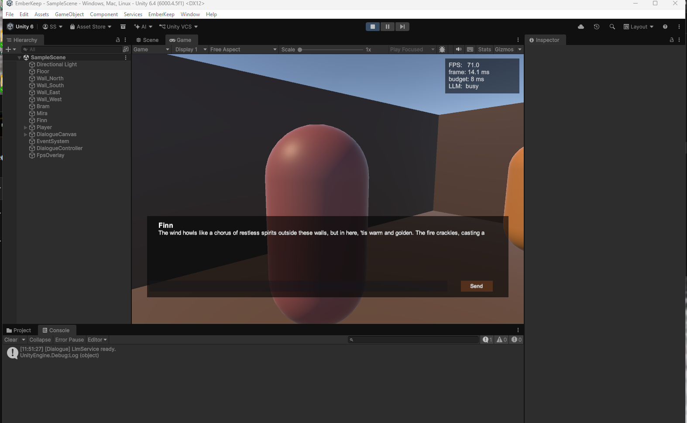
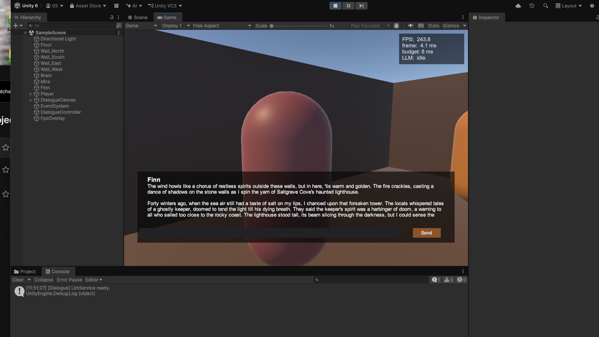
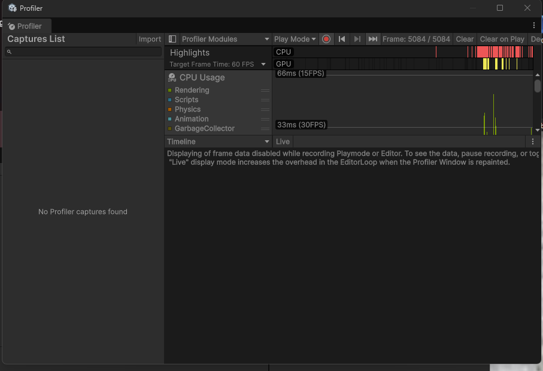

# EmberKeep

> A Unity 6 tech demo where every NPC runs a quantized 3B-parameter LLM locally on the player's machine, holds persistent memory across sessions, and stays within a strict per-frame inference budget so the game maintains a steady 60 FPS.

**Status:** In active development — Day 1 of a 7-day MVP. See [Roadmap](#roadmap).

---

## Why I built this

Most "AI in games" demos call out to GPT-4 over the network. That's not shippable: it's expensive at scale, latency is unpredictable, it requires always-online play, and player conversations leave the device. EmberKeep is a working answer to the harder question — **what does it actually take to run a generative LLM *inside* a game engine, on consumer hardware, without dropping a frame?**

The codebase demonstrates the production-hard parts of shipping GenAI in real games: quantized on-device inference, frame-budget enforcement, behavior-tree + LLM hybrid NPCs, persistent character memory, and an editor tool that turns the LLM into an "AI superpower" for the design team.

## What's in the demo

| NPC | Technique Demonstrated |
|---|---|
| **Bram the Innkeeper** | Pure-LLM dialogue with persistent cross-session memory via prompt-injected summaries |
| **Mira the Merchant** | Behavior-tree-driven intent (haggle / refuse / accept) with LLM-generated dialogue lines — the production-correct pattern for shippable NPC AI |
| **Old Finn the Storyteller** | On-demand procedural short stories with streaming token rendering and perceived-latency masking |
| **"Generate NPC" Editor Tool** | Unity inspector window: type a one-line concept, get a full NPC ScriptableObject with backstory, voice profile, and sample lines |

## Architecture

```
+-----------------------------------------------------------+
|                     Unity Main Thread                     |
|                                                           |
|   NPC GameObject  <-->  Dialogue UI    Behavior Tree      |
|         |                                  |              |
|         +---->   LlmService (C#)     <-----+              |
|                  - Prompt builder                         |
|                  - Token queue poller                     |
|                  - Memory store (JSON)                    |
+-----------------------|-----------------------------------+
                        |  Lock-free SPSC queue
                        |  (tokens up, prompts down)
+-----------------------|-----------------------------------+
|                       v       Inference Worker Thread     |
|         LlamaCppBridge (C#)  -->  emberkeep_native.dll    |
|                                   - llama.cpp wrapper     |
|                                   - KV-cache mgmt         |
|                                   - Per-NPC sessions      |
|                                          |                |
|                                          v                |
|                              Llama-3.2-3B Q4_K_M (~2.0GB) |
+-----------------------------------------------------------+
```

**Why this design:** the main thread never blocks on inference. Tokens are produced on a worker thread and dequeued at most once per frame, capped at a per-frame budget (target 8ms = half of a 60 FPS frame). The result is that generation feels real-time to the player, but the render loop never starves.

## Performance

Measured on a development machine running Llama-3.2-3B-Instruct (Q4_K_M, ~2.0 GB on disk) on CPU only, with the worker-thread architecture handing tokens to Unity's main thread one at a time.

| Metric | Value | Hardware |
|---|---|---|
| Model | Llama-3.2-3B-Instruct, Q4_K_M | — |
| On-disk size | ~2.0 GB | — |
| Backend | llama.cpp `b8996`, AVX2 + FMA + F16C, 6 threads | — |
| Tokens / second (story stream) | **9.0 tok/s** | Intel Core Ultra 7 155H (16 cores), 32 GB |
| Time-to-first-token (cold) | 5858 ms | Intel Core Ultra 7 155H |
| **FPS during inference (LLM busy)** | **71 FPS** (14.1 ms/frame) | Intel Core Ultra 7 155H |
| FPS at rest | 243 FPS (4.1 ms/frame) | Intel Core Ultra 7 155H |
| 60 FPS target budget | 16.67 ms/frame | — |
| Per-frame inference budget | 8 ms (HUD-documented) | — |
| Profiler main-thread time during inference | 7.57 ms | Intel Core Ultra 7 155H |

The headline result: **the render loop sustains 71 FPS while the LLM is fully saturating its 6 worker-thread cores** — well above the 60 FPS target. The Unity Profiler shows main-thread frame time at 7.57 ms during active generation, less than half the 16.67 ms 60-FPS budget.

### FPS overlay — inference vs. idle

| LLM busy (Finn streaming a story) | LLM idle (story finished) |
|---|---|
|  |  |

### Unity Profiler — main thread during inference



The full measurement log, raw screenshots, and capture instructions live in [`docs/perf/`](docs/perf/).

## Live Ops + Telemetry

A separate layer of the architecture handles instrumentation and runtime configuration without touching the core dialogue path:

- **`LiveOpsConfig`** — JSON-driven runtime config at `<persistentDataPath>/liveops.json`. Hot-reloaded at the start of every dialogue so a designer can flip `safety_filter_enabled`, `memory_enabled`, `max_response_tokens_override`, `max_story_tokens_override`, `per_frame_budget_ms`, or `ab_variant` mid-session without rebuilding the player.
- **`Telemetry`** — local-first event emitter with a background-thread JSONL writer at `<persistentDataPath>/telemetry/YYYY-MM-DD.jsonl`. Schema is wire-compatible with Mixpanel / Amplitude / GameAnalytics; swapping the file writer for an HttpClient POST is a one-line change.
- **Telemetry Dashboard** (`EmberKeep → Telemetry Dashboard` editor menu) — aggregates events into headline counts, per-NPC turn breakdowns, average tokens / sec, and safety blocks by reason.

Full schema and a representative log slice are documented in [`docs/telemetry_schema.md`](docs/telemetry_schema.md) and [`docs/perf/sample_telemetry.jsonl`](docs/perf/sample_telemetry.jsonl). The pipeline is intentionally local-first: nothing leaves the device by default, but the schema and writer are structured so a production deployment swaps to a backend without touching call sites.


## How it maps to shipping a real game

| Production Concern | How EmberKeep Addresses It |
|---|---|
| Frame-rate stability | Worker-thread inference, per-frame token budget, lock-free queue |
| Memory footprint | Q4_K_M quantization (4-bit), shared model across NPCs, per-NPC KV-cache only |
| Cold-start latency | Model loaded once at scene-load, kept warm via empty-prompt prefill |
| Perceived latency | Streaming token rendering, typewriter UI |
| Character consistency | System-prompt grounding + summarized memory injection |
| Safety / refusal | Pre-generation prompt filter + post-generation content filter |
| Live Ops iteration | NPC personalities are ScriptableObjects — designers edit without code changes; runtime config in `liveops.json` hot-reloads on the next dialogue |
| Production observability | Local-first telemetry pipeline (Mixpanel-compatible JSONL schema) + designer-facing aggregation dashboard — see [`docs/telemetry_schema.md`](docs/telemetry_schema.md) |
| No PII leaves device | Fully on-device; no network calls during gameplay; telemetry is local-first by default |

## Project structure

```
emberkeep/
├── Assets/                       # Unity project root
│   ├── EmberKeep/
│   │   ├── Game/                 # Scene, NPC GameObjects, dialogue UI
│   │   ├── AI/                   # C# LlmService, prompt builder, memory store
│   │   ├── BehaviorTrees/        # Hand-rolled BT for Mira
│   │   ├── Editor/               # "Generate NPC" inspector tool
│   │   └── ScriptableObjects/    # NPC personality assets
│   └── Plugins/
│       └── x86_64/
│           └── emberkeep_native.dll
├── Native/
│   ├── emberkeep_native/         # C++ source for the plugin
│   ├── llama.cpp/                # git submodule
│   └── CMakeLists.txt
├── Models/
│   └── README.md                 # Instructions for downloading the GGUF
├── docs/
│   ├── architecture.png
│   └── perf/                     # Profiler screenshots
└── README.md
```

## Building from source

See [`Native/README.md`](Native/README.md) for native plugin build instructions.
See [`Models/README.md`](Models/README.md) for fetching the Llama-3.2-3B Q4_K_M weights.

The full build spec — scope rules, architecture rationale, day-by-day schedule, honesty rules — is in [`EmberKeep_Project_Spec.md`](EmberKeep_Project_Spec.md).

## Roadmap

- [x] Day 1 — Native plugin scaffolding + Unity C# bridge (stub)
- [ ] Day 2 — Real llama.cpp integration, first real LLM token in Unity
- [ ] Day 3 — Tavern scene + Bram conversation loop
- [ ] Day 4 — Mira behavior tree + BT→LLM intent wiring
- [ ] Day 5 — Old Finn streaming + persistent memory + safety filter
- [ ] Day 6 — "Generate NPC" editor tool + Profiler captures
- [ ] Day 7 — Demo video + technical blog post
- [ ] Stretch — Speculative decoding (Llama-3.2-1B drafts, 3B verifies)
- [ ] Stretch — Local TTS via Piper
- [ ] Stretch — macOS / Linux native plugin builds

## License

MIT. The Llama-3.2 model weights are subject to [Meta's license](https://www.llama.com/llama3_2/license/).

## About

Built by [Samuel Shamber](https://github.com/PhoenixWild29) as a tech demonstrator for shipping GenAI features inside production game engines.
