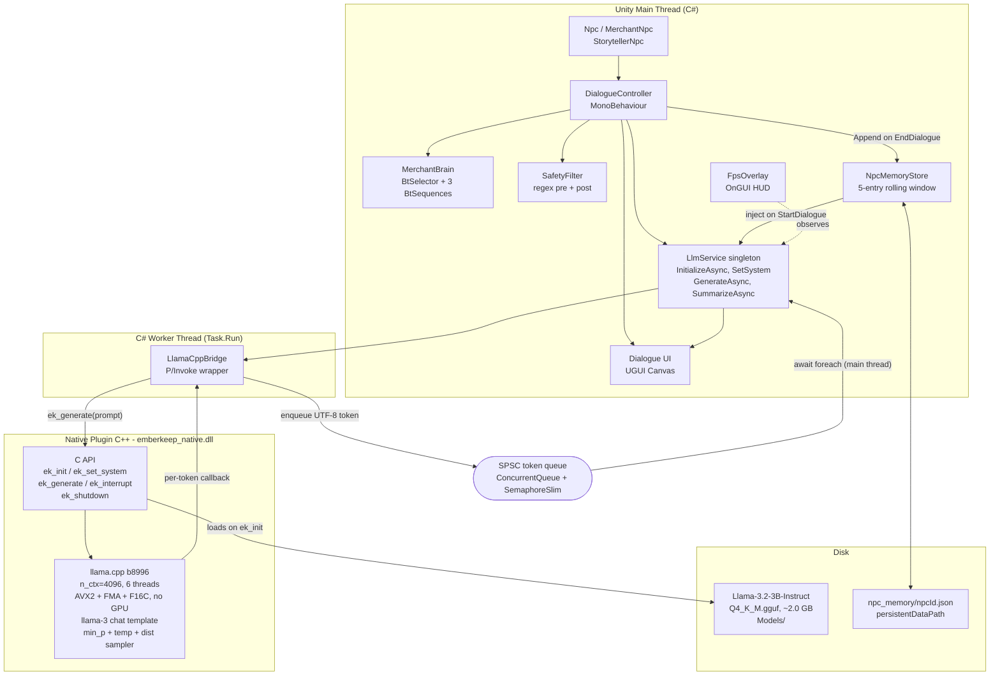
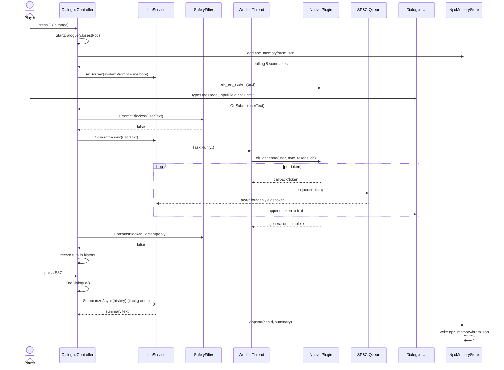

# EmberKeep Architecture

EmberKeep is a Unity 6 tech demo that runs a local Llama-3.2-3B-Instruct model
entirely on-device (Windows x64, CPU-only). The diagrams below show the
three-thread structure that keeps the render loop fluid while inference runs:
a Unity main thread for rendering and game logic, a managed worker thread that
drives the native plugin, and the C++ plugin itself that hosts llama.cpp. A
lock-free SPSC queue ferries tokens back to the UI.

---

## How to render these diagrams as PNGs

Two diagrams below. **GitHub renders them inline natively** — open this file on
github.com and you'll see the diagrams rendered. To **export a PNG** for the
README, blog post, or slides:

1. Open <https://mermaid.live> in a browser.
2. Clear whatever is in the left pane.
3. **Copy everything between the `=== COPY START ===` and `=== COPY END ===`
   markers below** (do **not** copy the markers themselves).
4. Paste into the left pane of mermaid.live.
5. Click **Actions → PNG** (top of the right pane) to download.

The same content also appears in a `mermaid` code block underneath each
copy-paste section, so the file renders correctly when viewed on GitHub.

---

## Diagram 1 — Component Architecture

### Copy this into mermaid.live

```
=== COPY START ===
flowchart TD
    subgraph Main["Unity Main Thread (C#)"]
        DC["DialogueController<br/>MonoBehaviour"]
        NPC["Npc / MerchantNpc<br/>StorytellerNpc"]
        BT["MerchantBrain<br/>BtSelector + 3 BtSequences"]
        UI["Dialogue UI<br/>UGUI Canvas"]
        SF["SafetyFilter<br/>regex pre + post"]
        FPS["FpsOverlay<br/>OnGUI HUD"]
        LS["LlmService singleton<br/>InitializeAsync, SetSystem<br/>GenerateAsync, SummarizeAsync"]
        MS["NpcMemoryStore<br/>5-entry rolling window"]
    end

    subgraph Worker["C# Worker Thread (Task.Run)"]
        BR["LlamaCppBridge<br/>P/Invoke wrapper"]
    end

    subgraph Native["Native Plugin C++ - emberkeep_native.dll"]
        API["C API<br/>ek_init / ek_set_system<br/>ek_generate / ek_interrupt<br/>ek_shutdown"]
        LCPP["llama.cpp b8996<br/>n_ctx=4096, 6 threads<br/>AVX2 + FMA + F16C, no GPU<br/>llama-3 chat template<br/>min_p + temp + dist sampler"]
    end

    subgraph Disk["Disk"]
        GGUF["Llama-3.2-3B-Instruct<br/>Q4_K_M.gguf, ~2.0 GB<br/>Models/"]
        MEMJSON["npc_memory/npcId.json<br/>persistentDataPath"]
    end

    QUEUE(["SPSC token queue<br/>ConcurrentQueue + SemaphoreSlim"])

    NPC --> DC
    DC --> BT
    DC --> SF
    DC --> UI
    DC --> LS
    LS --> BR
    BR -- "ek_generate(prompt)" --> API
    API --> LCPP
    LCPP -- "per-token callback" --> BR
    BR -- "enqueue UTF-8 token" --> QUEUE
    QUEUE -- "await foreach (main thread)" --> LS
    LS --> UI

    API -- "loads on ek_init" --> GGUF
    DC -- "Append on EndDialogue" --> MS
    MS <--> MEMJSON
    MS -- "inject on StartDialogue" --> LS

    FPS -.observes.-> LS
=== COPY END ===
```

The main thread owns all rendering, NPC GameObjects, the behavior tree tick,
the dialogue Canvas, and `LlmService`. When a turn fires, `LlmService`
schedules `ek_generate` on a `Task.Run` worker; the native plugin produces
tokens on its own ggml thread pool and pushes each token back through the
bridge into the SPSC queue. The main thread dequeues at most a small budget
per frame and appends to UI text. The model file and per-NPC memory are the
only persistent state on disk.

### Same diagram in a mermaid code block (renders inline on GitHub)



---

## Diagram 2 — Conversation Turn (Bram)

### Copy this into mermaid.live

```
=== COPY START ===
sequenceDiagram
    actor Player
    participant DC as DialogueController
    participant LS as LlmService
    participant SF as SafetyFilter
    participant W as Worker Thread
    participant N as Native Plugin
    participant Q as SPSC Queue
    participant UI as Dialogue UI
    participant MS as NpcMemoryStore

    Player->>DC: press E (in range)
    DC->>DC: StartDialogue(closestNpc)
    DC->>MS: load npc_memory/bram.json
    MS-->>DC: rolling 5 summaries
    DC->>LS: SetSystem(systemPrompt + memory)
    LS->>N: ek_set_system(text)

    Player->>UI: types message, InputField.onSubmit
    UI->>DC: OnSubmit(userText)
    DC->>SF: IsPromptBlocked(userText)
    SF-->>DC: false
    DC->>LS: GenerateAsync(userText)
    LS->>W: Task.Run(...)
    W->>N: ek_generate(user, max_tokens, cb)

    loop per token
        N-->>W: callback(token)
        W->>Q: enqueue(token)
        Q-->>LS: await foreach yields token
        LS->>UI: append token to text
    end

    N-->>W: generation complete
    DC->>SF: ContainsBlockedContent(reply)
    SF-->>DC: false
    DC->>DC: record turn in history

    Player->>DC: press ESC
    DC->>DC: EndDialogue()
    DC-)LS: SummarizeAsync(history) (background)
    LS-->>DC: summary text
    DC->>MS: Append(npcId, summary)
    MS->>MS: write npc_memory/bram.json
=== COPY END ===
```

The sequence diagram tracks one full Bram conversation: the player walks into
range, the system loads past summaries, the player types, the safety filter
runs at both ends of the LLM call, tokens stream from the worker through the
SPSC queue to the UI one at a time, and on ESC the dialogue summarises itself
into the next visit's memory.

### Same diagram in a mermaid code block (renders inline on GitHub)



---

## Why this design

The main thread never blocks on inference. Tokens are produced on a worker
thread and dequeued at most once per frame, capped at a per-frame budget, so
the render loop never starves regardless of how slow the model is on a given
turn. The handoff is a lock-free single-producer / single-consumer queue
(`ConcurrentQueue<string>` + `SemaphoreSlim`), which avoids mutex contention
between the C# worker pushing tokens and the main thread pulling them. Each
NPC keeps its own KV-cache lineage by clearing context per turn and re-applying
the llama-3 chat template with that NPC's system prompt and rolling 5-summary
memory, so personalities do not bleed across characters. The native plugin is
a thin C ABI over llama.cpp b8996 statically linked, which keeps the
Unity-side surface to five P/Invoke entry points and lets the same plugin be
swapped between models by changing only the GGUF path.
